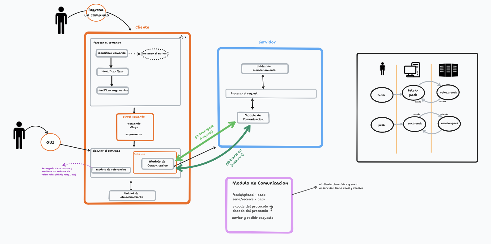

# 23C2-Cangrejos-Tacticos

Repo for Rust Taller De Programacion 1 FIUBA

## Integrantes

- [Juan Pablo Carosi Warburg](https://github.com/JuampiCarosi)
- [Mateo Daniel Vroonland](https://github.com/MateoVroonland)
- [Siro Fatala](https://github.com/Siro-000)
- [Juan Ignacio Perez Di Chiazza](https://github.com/JuaniFIUBA)

## Preparacion

### Casos de usos de comandos

Realizamos un documento con los comando para esta primera parte del TP, donde detallamos Nombre, Descripción, Precondiciones, Postcondiciones, Flujo, Errores, Info. Auxiliar.
[Link](https://docs.google.com/document/d/1YQVEbZWpcTxVPtevdTQRGLZyZjCM1OuWfK9f1--xii4/edit?usp=sharing)

### Cronograma planeado

Realizamos un documento con el cronograma planeado para esta primera parte del TP, donde detallamos las tareas a realizar semana a semana.
[Link](https://docs.google.com/spreadsheets/d/1zMW_DAc9MXoI6xk1ST1oP9UJRlPCdEcRXhwCicGHFXo/edit?usp=sharing)

### Diagrama de infraestructura



### Notas
Para correr los tests se deben correr con la opcion de un thread

```
cargo test -- --test-threads 1
```

